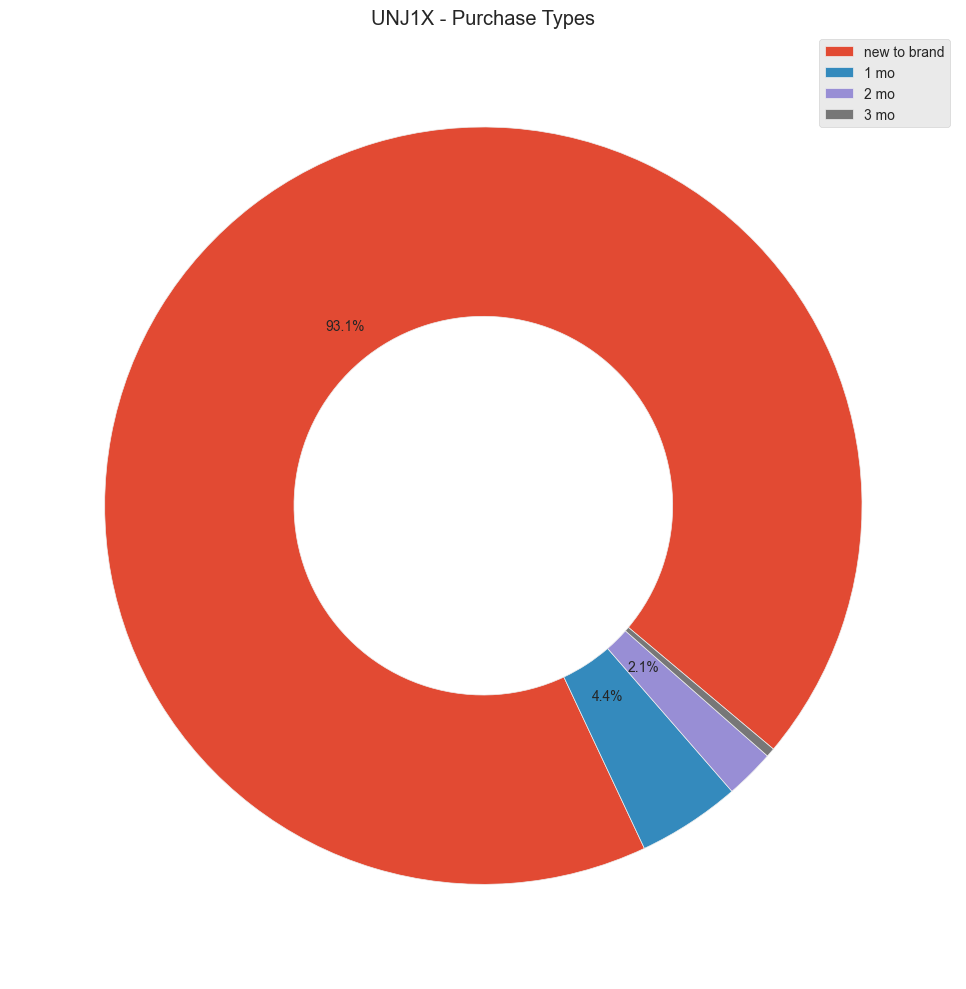
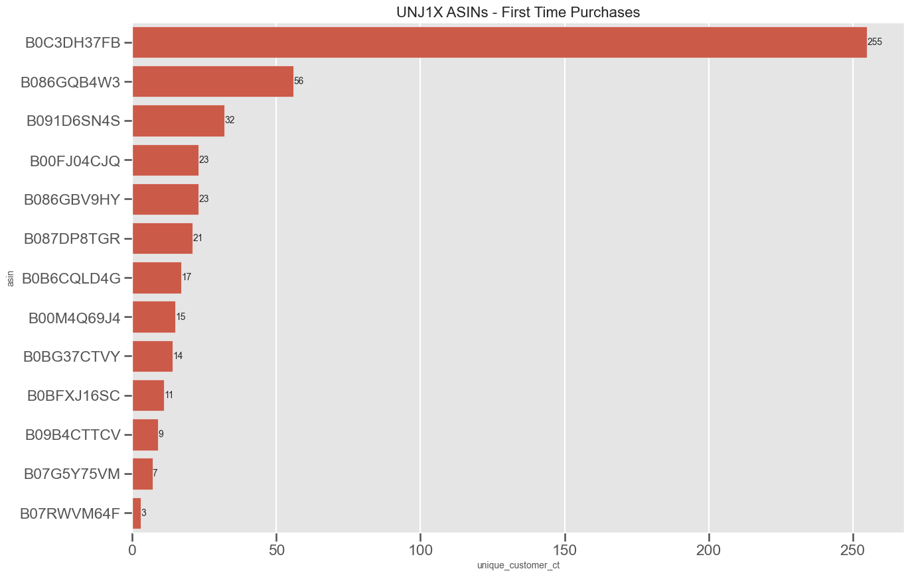
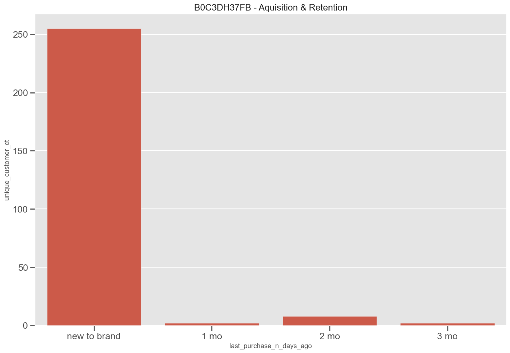
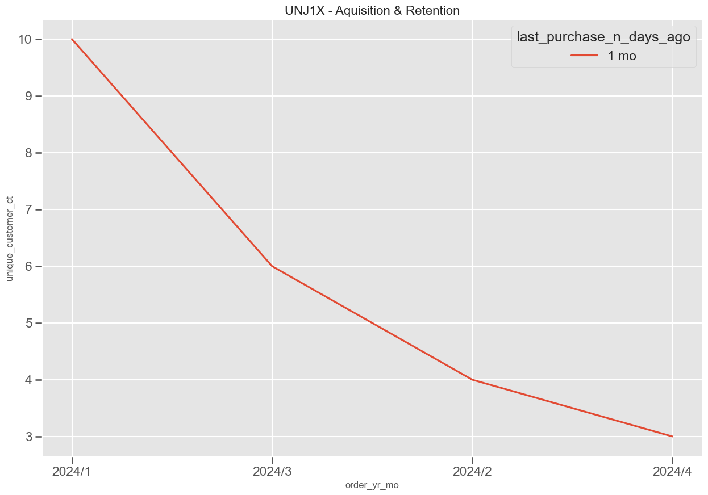
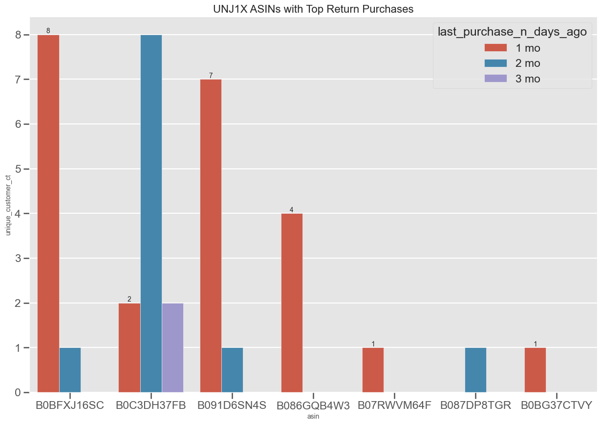

# Acquisition & Retention Analysis

## 0. Table of Contents
1. Use Cases
2. Installation
3. Usage
4. Contributing
5. License

## 1. Use Case Examples
This project helps answer following acquisition/ retention-related questions for both VMs and vendors:

### 1.1 Acquisition (NTB)
#### Example 1: old vs new customers make up; or how long it takes for a customer to make a return purchase



#### Example 2: Which ASIN/brand/company has the highest NTB % and sales during a marquee event or a given period?


#### Example 3: which ASIN/brand/company is bringing back the most amount of return purchases?

#### Example 4: how does that compare to peers in the same category?

#### Example 5: how does CA Pets do overall in terms of NTB customer aquisition?

### 1.2 retention (beyond first purchases)
#### Example 1: how long does it take for a customer to make a return purchase?


#### Example 2: How many 1-month return purchase orders over time?


#### Example 3: ASINs with top return purchases?



### 1.3 HVE lift
  - how does my NTB % look like during an HVE vs benchmark normal period?

## 2. Definition
- **New to Brand**: A customer is considered as "new to brand" when they did not purchased anything from a Bonsai brand in a given period (e.g. 3 months)
- **Benchmark**: If a transaction was made 2-3 weeks prior to an HVE, it'll go into the daily sales calculation for a "normal" period.

## 3. Installation
1. Clone the repository:
```bash
 git clone https://github.com/yourusername/yourproject.git
```

2. Install dependencies:
```bash
# install java 8
sudo add-apt-repository ppa:webupd8team/java
sudo apt-get update
sudo apt-get install oracle-java8-installer

npm install
 ```

## 4. Usage
To run the project, use the following command:
```bash
npm start
```

## 5. Contributing
1. Fork the repository.
2. Create a new branch: `git checkout -b feature-name`.
3. Make your changes.
4. Push your branch: `git push origin feature-name`.
5. Create a pull request.

## 6. License
This project is licensed under the [MIT License](LICENSE).